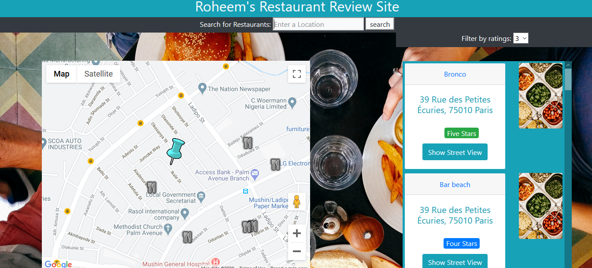

# Project 7 © Roheem Olayemi 

-> FIRST I'LL DO STEP 1, THEN STEP 2 AND FINALLY STEP 3 !

## STEP 1: RESTAURANTS

	1. Get user's location 

	2. Put focus on user's location 

	3. Specific color marker on that location 

	4. When you click on a restaurant, show its google street view photo 

	5. If restaurants aren't visible, don't put them in the menu. Else show them in the menu 

	6. Filter tool display restaurant b/w X and Y stars. 

## STEP 2: ADD RESTAURANTS AND REVIEWS

	7. Add a review to existing restaurants (onclick event) / create a form, essentially

	8. Create a new restaurant when clicking on the map 

## STEP 3: ADD Google Places

	9. Find an API to retrieve restaurants and reviews! Use it to display additional restaurants and reviews on your map so you don't have to use only your JSON file. 

## HOW TO RUN MY APP :

	1. Clone this repository wherever you see fit on your machine

	2. Install npm (node package manager)

	3. Run npm install http-server

	4. Run http-server in "OC P7" directory. Then type localhost:8080 in your browser url bar. 

	5. It's not working ? This means I deactivated my API key. To solve this :

		* Go to console.developers.google.com

		* Get an API key

		* Enable billing

		* Enable the necessary APIs (Maps Javascript, Places, Streetview)

	6. You're all set. Enjoy !

	N.B : To run this app, you need to have your own Google Maps API key, to enable 
